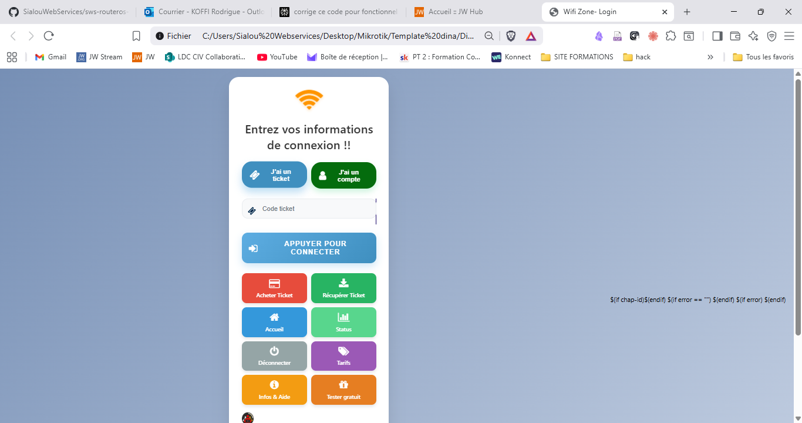
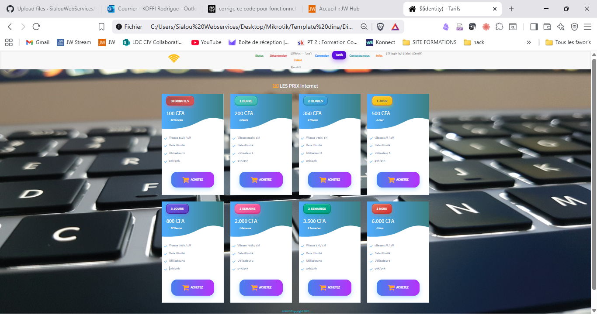

# 🌐 SWS RouterOs - Template MikroTik Captive Portal Moderne


Un template moderne et élégant pour portail captif MikroTik avec interface utilisateur optimisée et design responsive.

## ✨ Aperçu

**SWS RouterOs** est un template complet de portail captif (Captive Portal) conçu spécialement pour les routeurs MikroTik. Il offre une expérience utilisateur moderne avec un design responsive qui s'adapte parfaitement aux appareils mobiles et desktop.

### 🎯 Fonctionnalités Principales

- ✅ **Interface moderne** avec animations fluides et design glassmorphism
- ✅ **100% Responsive** - Compatible mobile, tablette et desktop
- ✅ **Double authentification** - Support tickets et comptes utilisateur
- ✅ **Intégration MikroTik** complète avec authentification CHAP
- ✅ **Pages de tarification** dynamiques avec forfaits personnalisables
- ✅ **Gestion d'erreurs** avancée avec messages contextuels
- ✅ **Multi-langues** prêt (Français inclus)
- ✅ **Boutons d'action** colorés selon l'action (rouge=danger, vert=succès, etc.)

## 🖼️ Captures d'écran

### Page de Connexion


### Page de Tarification


### Interface Mobile


## 🚀 Installation

### Prérequis
- RouterOS MikroTik v6.x ou supérieur
- Accès administrateur au routeur
- Connexion Internet pour les ressources externes (optionnel)

### Installation Rapide

1. **Téléchargez le template**
   ```bash
   git clone https://github.com/SialouWebServices/sws-routeros-template.git
   ```

2. **Uploadez les fichiers sur MikroTik**
   - Connectez-vous à votre routeur MikroTik via Winbox ou WebFig
   - Allez dans **Files** et uploadez tous les fichiers du template
   - Respectez la structure des dossiers

3. **Configurez le Hotspot**
   ```bash
   # Via Terminal MikroTik
   /ip hotspot profile
   set hsprof1 html-directory=hotspot login-by=cookie,http-chap
   ```

4. **Activez le template**
   - Allez dans **IP > Hotspot > Server Profiles**
   - Sélectionnez votre profil et définissez **HTML Directory** sur `hotspot`

## 📁 Structure du Projet

```
sws-routeros-template/
├── 📄 login.html          # Page principale de connexion
├── 📄 package.html        # Page de tarification
├── 📄 status.html         # Page de statut utilisateur
├── 📄 logout.html         # Page de déconnexion
├── 📄 error.html          # Page d'erreur
├── 📄 about.html          # Page d'informations
├── 📄 contact.html        # Page de contact
├── 📁 css/
│   ├── modern-ui.css      # Styles principaux modernes
│   └── pricing-buttons.css # Styles pour les boutons de tarification
├── 📁 js/
│   ├── main.js           # Scripts principaux
│   └── custom.js         # Scripts personnalisés
├── 📁 images/
│   ├── bg.jpg            # Image de fond
│   ├── brand.png         # Logo de marque
│   └── ...               # Autres images
├── 📁 fonts/             # Polices Font Awesome
├── 📁 reload/            # Pages de rechargement
└── 📁 assets/            # Ressources JavaScript
```

## 🎨 Personnalisation

### Couleurs et Thème

Le template utilise des variables CSS pour une personnalisation facile :

```css
:root {
  --primary-blue: #5DADE2;
  --primary-green: #58D68D;
  --primary-orange: #FF9500;
  --instruction-size: 30px;  /* Taille du texte d'instruction */
  --input-size: 16px;        /* Taille des champs de saisie */
  --icon-size: 25px;         /* Taille des icônes */
}
```

### Modification du Logo

1. Remplacez `images/brand.png` par votre logo
2. Dimensions recommandées : 120×80px (desktop), 100×65px (mobile)
3. Le logo sera automatiquement centré et responsive

### Personnalisation des Forfaits

Éditez `package.html` pour modifier :
- Prix des forfaits
- Durées de connexion
- Liens de paiement
- Descriptions des services

## 🔧 Configuration Avancée

### Intégration avec Système de Paiement

Le template est pré-configuré pour TicketWiFi mais peut être adapté :

```html
<!-- Dans package.html -->
<a href="https://votre-systeme-paiement.com/forfait/1h">
  Acheter 1 Heure
</a>
```

### Variables MikroTik Supportées

- `$(identity)` - Nom du routeur
- `$(link-login-only)` - Lien de connexion
- `$(link-orig)` - URL de destination
- `$(error)` - Messages d'erreur
- `$(mac)` - Adresse MAC du client
- `$(ip)` - Adresse IP du client
- `$(username)` - Nom d'utilisateur connecté
- `$(uptime)` - Temps de connexion

## 📱 Responsive Design

Le template s'adapte automatiquement à tous les types d'écrans :

- **Mobile** (< 480px) : Interface simplifiée, boutons empilés
- **Tablette** (481px - 768px) : Disposition optimisée
- **Desktop** (> 768px) : Interface complète avec toutes les fonctionnalités

## 🌍 Internationalisation

### Langues Supportées
- ✅ Français (par défaut)
- 🔄 Anglais (en cours)
- 🔄 Espagnol (planifié)

### Ajouter une Nouvelle Langue

1. Dupliquez `login.html` vers `login-en.html`
2. Traduisez tous les textes
3. Modifiez les liens dans la navigation

## 🛠️ Développement

### Prérequis pour Développer
- Éditeur de code (VS Code recommandé)
- Serveur web local pour les tests
- Connaissance de base en HTML/CSS/JavaScript

### Tests Locaux
```bash
# Avec Python
python -m http.server 8000

# Avec Node.js
npx serve .

# Avec PHP
php -S localhost:8000
```

## 🤝 Contribution

Nous accueillons toutes les contributions ! Voici comment participer :

1. **Fork** le projet
2. Créez votre branche (`git checkout -b feature/AmazingFeature`)
3. **Commit** vos changements (`git commit -m 'Add some AmazingFeature'`)
4. **Push** vers la branche (`git push origin feature/AmazingFeature`)
5. Ouvrez une **Pull Request**

### Guidelines de Contribution
- Respectez le style de code existant
- Testez sur mobile et desktop
- Documentez les nouvelles fonctionnalités
- Vérifiez la compatibilité MikroTik

## 🐛 Signaler un Bug

Si vous trouvez un bug, merci de créer une [issue](https://github.com/SialouWebServices/sws-routeros-template/issues) avec :

- Description détaillée du problème
- Version de RouterOS
- Type d'appareil (mobile/desktop)
- Navigateur utilisé
- Captures d'écran si possible

## 📄 Licence

Ce projet est sous licence MIT. Voir le fichier [LICENSE](LICENSE) pour plus de détails.

## 👨‍💻 Auteur

**SW Service** - *Développement initial* - [Site Web](https://swservice.carrd.co/)

## 🙏 Remerciements

- MikroTik pour leur excellente documentation
- Font Awesome pour les icônes
- La communauté open source pour l'inspiration

## 📊 Statistiques


---

<div align="center">
  <strong>Développé avec ❤️ par SW Service</strong><br>
  <a href="https://swservice.carrd.co/">Site Web</a> • 
  <a href="mailto:contact@swservice.com">Contact</a>
</div>